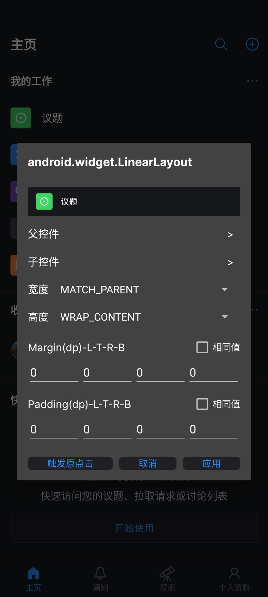
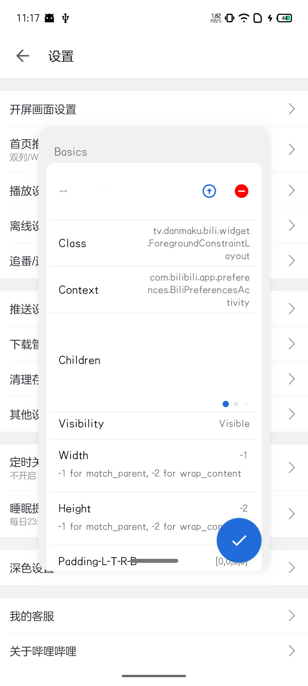
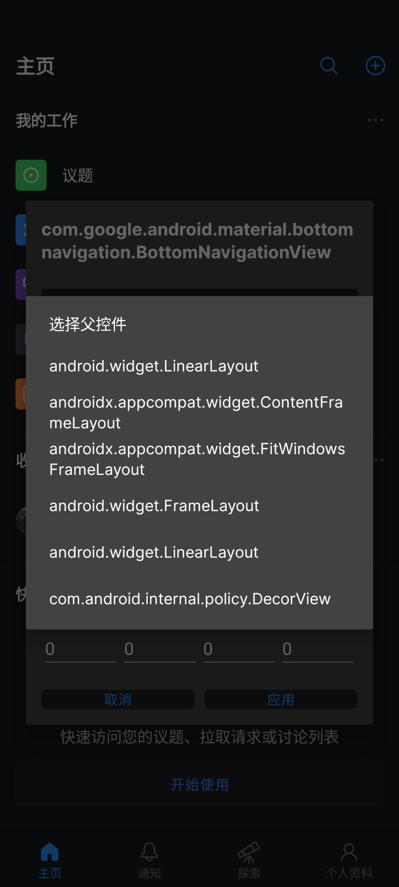
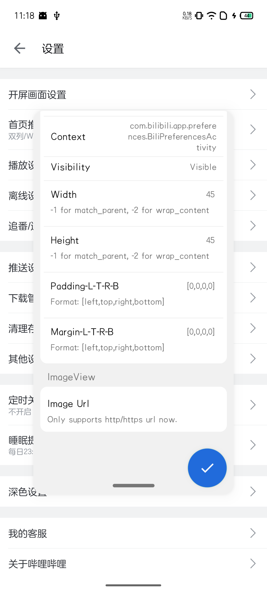

# AnyDebug

Change your view attributes without restarting your application.

不需要重启应用，就可以更改View的参数。

# About

This software relies on the [Xposed Framework](https://github.com/rovo89/Xposed), For more API details, visit their [website](https://api.xposed.info/).

本应用依赖于[Xposed框架](https://github.com/rovo89/Xposed)。需要获取更多关于这个框架的信息，请访问他们的[官网](https://api.xposed.info/)。

# Contribution

This software changes view attributes while app's running. It's not quite difficult, but I got many works to do, since there are too many Views and too many attributes per view. Your PR are very welcome.

本应用运行原理是在app运行的过程中，动态修改一些View的参数。虽然说不是很难，但是还是有一定的代码量的，毕竟Android中的View还是挺多的。欢迎PR。

# Caution

This application is completely free and 100% open-source.  It's just for learning usage. I don't take any responsibilities for the  result you make while using this application.

本应用完全开源免费，且仅供学习交流使用。使用者在使用本应用的过程产生的任何后果都与开发者无关。

# FAQ

+ App becomes laggy

View tree needs to be traversed to ensure the new-added views can be properly hooked. I tried to hook the `onAttachedToWindow` method, but it would hook my own dialog as well. Looking for another better solution.

+ Persistent changes behave weirdly, especially in list items

The way to store changes and re-apply them to the origin view is not perfect yet. To locate a view, the `id` of the view and its parent, and the class name should be unique. But in android apps, view id is not always unique, so some rules may be apply to another view.
Be cautious when you use persistent editing, especially in list views.

# Not working on some apps

Only works on navtive android app. Some views may override `onTouchEvent` and doesn't call `performClick`, this module won't work in that situation.

+ 应用变卡了

因为要遍历View树，来保证新添加的View能够被正确地hook掉。我之前尝试过hook `onAttachedToWindow`，但那会连我自定义的对话框也一起hook。正在寻找更好的方法。

+ 持久化编辑有点怪怪的，特别是在一些列表项中

持久化编辑的方法目前仍未完美。为了在view树中定位一个view，需要知道view的id，以及view的父view的id，还有view的类名。但Android中id在view树中并不是唯一的，特别是在列表里，所以一些持久化规则可能会被应用到其他view上。
请谨慎使用持久化编辑，特别是在一些列表项中。

+ 某些应用中没法使用

只支持原生Android应用。一些控件可能会重写`onTouchEvent`而不调用`performClick`方法，这种情况也是没法使用的。

# Sample

|  |  |  |  |
| -- | -- | -- | -- |
